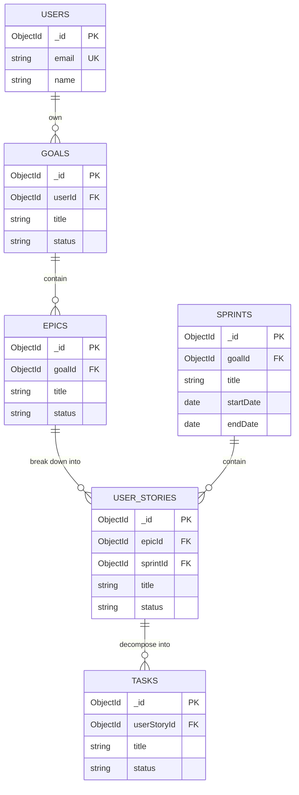

# Database Design Document

## 1. Overview

This document outlines the database schema for a goal-setting application that leverages Scrum methodologies. The design uses a NoSQL, document-based model (e.g., MongoDB) to provide flexibility and scalability. The core concept is a normalized data structure where distinct entities are stored in separate collections and linked via `ObjectId` references.

## 2. Entity-Relationship Diagram (ERD)

The following diagram illustrates the relationships between the primary entities in the database.

## 3. Collection Schemas

### 3.1. `users`

Stores user authentication and profile information.

| Field Name       | Data Type | Description                         | Constraints/Notes             |
| :--------------- | :-------- | :---------------------------------- | :---------------------------- |
| `_id`            | ObjectId  | Unique identifier for the document. | Primary Key                   |
| `email`          | String    | User's email address for login.     | Required, Unique, Indexed     |
| `hashedPassword` | String    | Hashed and salted user password.    | Required                      |
| `name`           | String    | User's full name or display name.   | Required                      |
| `createdAt`      | Date      | Timestamp of user creation.         | Required, Default: `Date.now` |

---

### 3.2. `goals`

The top-level entity representing a user's objective.

| Field Name    | Data Type | Description                                | Constraints/Notes                                         |
| :------------ | :-------- | :----------------------------------------- | :-------------------------------------------------------- |
| `_id`         | ObjectId  | Unique identifier for the document.        | Primary Key                                               |
| `userId`      | ObjectId  | Reference to the `users` collection.       | Required, Indexed, Foreign Key                            |
| `title`       | String    | The main title of the goal.                | Required                                                  |
| `description` | String    | A detailed description of the goal.        | Optional                                                  |
| `targetDate`  | Date      | The intended completion date for the goal. | Optional                                                  |
| `status`      | String    | Current status of the goal.                | Required, Enum: `not-started`, `in-progress`, `completed` |
| `createdAt`   | Date      | Timestamp of goal creation.                | Required, Default: `Date.now`                             |

---

### 3.3. `epics`

Represents a major milestone or a large component of a `goal`.

| Field Name    | Data Type | Description                               | Constraints/Notes                                         |
| :------------ | :-------- | :---------------------------------------- | :-------------------------------------------------------- |
| `_id`         | ObjectId  | Unique identifier for the document.       | Primary Key                                               |
| `goalId`      | ObjectId  | Reference to the `goals` collection.      | Required, Indexed, Foreign Key                            |
| `title`       | String    | The title of the epic.                    | Required                                                  |
| `description` | String    | A detailed description of the epic.       | Optional                                                  |
| `status`      | String    | Current status of the epic.               | Required, Enum: `not-started`, `in-progress`, `completed` |
| `order`       | Number    | A number to define the sequence of epics. | Required                                                  |
| `createdAt`   | Date      | Timestamp of epic creation.               | Required, Default: `Date.now`                             |

---

### 3.5. `user_stories`

The smallest, actionable unit of work. Analogous to a user story or task in Scrum.

| Field Name    | Data Type | Description                            | Constraints/Notes                              |
| :------------ | :-------- | :------------------------------------- | :--------------------------------------------- |
| `_id`         | ObjectId  | Unique identifier for the document.    | Primary Key                                    |
| `epicId`      | ObjectId  | Reference to the `epics` collection.   | Required, Indexed, Foreign Key                 |
| `sprintId`    | ObjectId  | Reference to the `sprints` collection. | Optional, Indexed, Foreign Key                 |
| `title`       | String    | A concise description of the task.     | Required                                       |
| `description` | String    | More details about the task.           | Optional                                       |
| `status`      | String    | The current state of the task.         | Required, Enum: `to-do`, `in-progress`, `done` |
| `storyPoints` | String    | An optional estimate of effort.        | Optional                                       |
| `createdAt`   | Date      | Timestamp of task creation.            | Required, Default: `Date.now`                  |

---

### 3.5. `tasks`

The smallest, actionable unit of work. Analogous to a user story or task in Scrum.

| Field Name    | Data Type | Description                                 | Constraints/Notes                              |
| :------------ | :-------- | :------------------------------------------ | :--------------------------------------------- |
| `_id`         | ObjectId  | Unique identifier for the document.         | Primary Key                                    |
| `userStoryId` | ObjectId  | Reference to the `user_stories` collection. | Required, Indexed, Foreign Key                 |
| `title`       | String    | A concise description of the task.          | Required                                       |
| `description` | String    | More details about the task.                | Optional                                       |
| `status`      | String    | The current state of the task.              | Required, Enum: `to-do`, `in-progress`, `done` |
| `createdAt`   | Date      | Timestamp of task creation.                 | Required, Default: `Date.now`                  |

---

### 3.6. `sprints`

A time-boxed period dedicated to completing a set of `tasks`.

| Field Name   | Data Type | Description                              | Constraints/Notes                                 |
| :----------- | :-------- | :--------------------------------------- | :------------------------------------------------ |
| `_id`        | ObjectId  | Unique identifier for the document.      | Primary Key                                       |
| `goalId`     | ObjectId  | Reference to the `goals` collection.     | Required, Indexed, Foreign Key                    |
| `title`      | String    | The name of the sprint (e.g., "Week 1"). | Required                                          |
| `sprintGoal` | String    | The specific objective for this sprint.  | Optional                                          |
| `status`     | String    | Current status of the sprint.            | Required, Enum: `upcoming`, `active`, `completed` |
| `startDate`  | Date      | The start date of the sprint.            | Required                                          |
| `endDate`    | Date      | The end date of the sprint.              | Required                                          |
| `createdAt`  | Date      | Timestamp of sprint creation.            | Required, Default: `Date.now`                     |

## 4. Indexing Strategy

To ensure efficient query performance, the following fields should be indexed:

- **`users`**: `email`
- **`goals`**: `userId`
- **`epics`**: `goalId`
- **`user_stories`**: `epicId`, `sprintId`
- **`tasks`**: `userStoryId`
- **`sprints`**: `goalId`

This will optimize common lookup operations, such as fetching all goals for a user or all tasks for a sprint.
